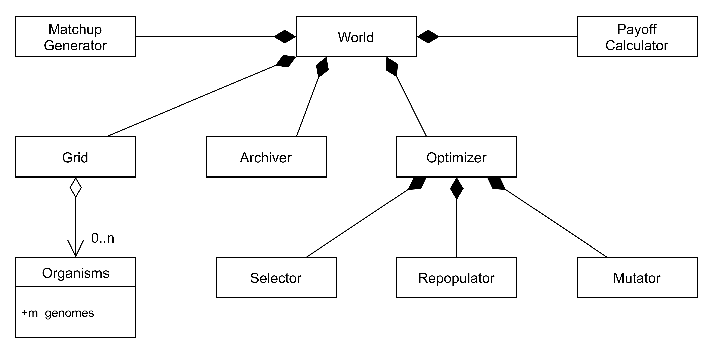
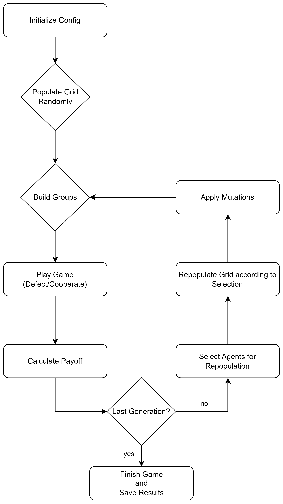

## Abstract / Summary
The Asymmetric Public Goods Game (APGG) C++ framework offers an easy to use environment to study game theoretical questions. Specifically, it is designed to address questions in the domain of asymmetric public goods games. The modular architecture allows for a vast amount of scenarios and setups for experimenting with different public goods games, using easy to change parameters. Users can experiment with well mixed and structured populations as well as with symmetric and asymmetric payoffs. APGG also features group level payoffs and individual payoffs, and different evolutionary selection mechanisms [@miller1995genetic] and replication schemes.
Results are automatically saved in semantic and descriptive structures and can be easily visualized with the included Python scripts.
This paper aims to explain the functionality and the structure of the framework, to show the workflow that APGG follows, to present the different modules that are available, and to show how APGG can be used to run experiments with public goods games on example scenarios.

{ width=50% }  

## Introduction / Literature Review
Public Good Games illustrate the tragedy of the commons [@hardin1968tragedy]. They have been intensively studied before, with an increasing interest in the asymmetric variant of the game [@mcginty2013public; @hintze2020inclusive]. Typically, game theoretical problems are solved using rigourous mathematical analysis, but that approach reaches its limits when it comes to the stochastic and random behavior of the evolutionary process [@adami2016evolutionary]. Consequently, computational models, such as this one, are used.

One problem of using computational models in research, is their oftentimes limited expandability. APGG remedies this problem by providing a modular framework, that is designed to be easily extended [@bohm2017mabe; @richter2019evo].

## What is a Public Goods Game
The tragedy of the commons describes an important social and economical phenomenon which pitches self interest against the interests of a group. Players in a Public Goods Game (PGG) can either contribute to a common pool (cooperate) or withhold their contribution (defect). The money collected in the pool is increased by a multiplicative synergy factor, and then equally distributed amongst the players. It becomes immediately clear that the defecting players will always receive the same as the cooperators, but end up having more money than the cooperators due to the amount they withheld before. The tragedy specifically describes the dilemma, that if all players would cooperate the total amount received by everyone would be higher, but the greed (or self interest) of the defectors prevents that favourable outcome.

The question is how to overcome the tragedy of the commons. In social societies, often institutions, regulations, and incentives are used [@fehr2002altruistic], [@hintze2020inclusive]. In the theoretical context, all of this becomes abstracted as costly punishment [@hardin1968tragedy]. This costly punishment has been shown to affect human behavior[@fehr2002altruistic] and can indeed lead to the evolution of cooperation [@hintze2015punishment]. Another option that alters the outcome towards cooperation could be asymmetric distribution of resources, as it can be found in many animal hierarchies. Hyenas for example have a steep dispotic index [@smith2007rank] while also cooperating with each other, supporting the idea of asymmetric payoffs potentially leading to cooperation.

## Statement of Need
Studying evolution in a biological systems is cumbersome, to say the least [@lenski2017experimental]. Consequently, using computational models becomes a viable alternative. However, for new experiments to build on previous results, the modeling software needs to be extendable. This leads to a challenging problem. Future users will independently modify the software to suit their own needs, with no regard for other users. This could create an ever growing tree of alternative versions, that might not be compatible with each other. Here, a modular design (see \autoref{fig:Classes}) approach is used, such that possible future users can define custom modules. However, those modules will remain interoperable, because interfaces are well defined.

## Code Overview

{ width=90% }  

**World**: Encapsulates a single experiment. The World Class is divided into 4 methods, init, tick (plays the game), evolve and fini. The main loop (tick and evolve) is being run within the world class and controls the entire game, by calling all the relevant classes and methods. All other classes are being initialized within the world class. World has no subclasses and is used for every experiment.

**Grid**: The grid is home to all organisms (the population), and functions as the playing field/game-board for the model. Grid does not necessarily have to be a “grid” in a geometric sense. All organisms are initialized onto the grid and the population will play, compete and evolve on the grid.
	The grid can either be used as a “grid” (spatialGrid), just like the word suggests, where the spatial location of the organisms matters and is taken into consideration. In the “defaultGrid” mode, where the grid only stores the organisms, the placement has no effect on the games and evolution (well mixed population). Extending this module allows users to define arbitrary population topologies.

**Organism**: The organisms in APGG are the class for the agents that participate in the evolutionary public goods games. Depending on the grid size, a fixed number of organisms will be spawned. Organisms contain a Genome which in turn holds the information that determines how agents act during the game. The Genomes are also used for the selection and repopulation process, as offspring will be derived from those Genomes by copying them. If users want to change how strategies are encoded this class should be modified. See Mutator for changing how Genomes are copied.

**Archiver**: The Archiver Class is used to collect data during the runtime of the model. It has 2 subclasses. The SimpleArchiver, which will write the status of the current generation (number of cooperators, defectors) as well as the LODArchiver, which will print the whole Line of Descent (for the best organism and his ancestors) to a file at the end of each experiment.

**Mutator**: The mutator is responsible for mutating the genome of organisms during the selection process. The chance for the organisms to mutate is set by the mutationRate parameter. If a random value between 0 and 1 exceeds the mutationRate, the genomes of the organism will be changed. Besides the normal (default) mutator, there is a threshold mutator, which will reassign the genome a new value within a specific range of the current value. Overloading this class allows users to implement other mutation schemes or modes.

**PayOffCalculator**: The payoff calculator is the calculation class of the APGG framework.
 It is used to calculate the payoff each organism receives based on its decisions. For example, in a PGG with punishment, the punishment cost and the punishment fine as well as the rewards from cooperation or defection are calculated. Other game modes can be implemented by overloading this class.

The payoff calculation for the PGG with punishment is a two step process. In the first step, the base costs, fines and payoff are calculated. The second step calculates the individual payoff based on the organism's decision. Depending on its decision, the organism has to pay a punishment cost or a punishment fine out of its individual payoff. There are payoff calculators for different scenarios: Asymmetric Payoff calculator - a calculator, which calculates the payoff based on a spatial tier list. Everyone transfers his individual payoff into a group pool. After that, everyone gets his individual payoff out of this pool based on his rank in the group [@smith2007rank].

The itIsNotReallyAGroupLevelPayoffCalculator [@hintze2020inclusive] is a calculator where everyone transfers a predefined part of his payoff into a group pool for group members to share rewards with each other. After everyone has paid into this pool, the pool will be split by the number of group members and the value will be added to the individual payoff.

## Workflow

{ width=50% }  

APGG was designed to be an easy to use framework for making experiments with Public Goods Games available to a wide range of users. Hence, the workflow \autoref{fig:Workflow} has been designed to not only please computer scientists but to also invite social and biological researchers with basic programming skills. To set up and configure an experiment or a set of them, all users have to do is edit a csv file in a spreadsheet software of their choice. To expand the framework by adding or changing modules only basic C++ programming knowledge is recommended.

The computer model runs using the following steps:

1. initialize the grid and create all organsims randomly
2. start the main loop for number of generations
3. generate all sets of players interacting in games during one generation
4. evaluate all sets of games
5. select those organisms who will reproduce based on their payoff
6. repopulate the grid using the organisms idenfied in the previous step
7. go to step 2, until the total number of desired generations is reached
8. save all data

## Proof of Concept

| Parameters          | $r$              |$\mu$        | Pop. Size       |Group Size |  $\gamma$       |  $\beta$         |
|---------------------|----------------|---------------|-----------------|-----------|-----------------|------------------|
| Value:              |   1.5 to 7.0   |  0.02         |     1000        |    5      | 0.2             |   0.8            |

**Table 1**: Parameters used to replicate Proof of Concept Experiments, where $r$ is the Synergy Factor, $\mu$ is the Mutation Rate, $\gamma$ is the Punishment Cost and $\beta$ is the Punishment Fine. The experiment was run for 500,000 generations with 100 replicates. The Random Mutator was picked, as was the Random Selector. The Repopulator the was used was the Proportionate Repopulator.

To prove the concept of the software, and to verify its functionality, we repeated the experiment from the paper by Hintze and Adami (2015) [@hintze2015punishment], Figure 6, where the critical point to go from defection to cooperation dependent on synergy factor in the public goods game with punishment is computed and compared to the same game without punishment (see \autoref{fig:Figure6}). For each datapoint along the axis of the synergy factor 10 replicate experiments were run. The results are qualitatively the same, and the identical critical points and overall model behavior were observed.

![This Figure displays the same result as [@hintze2015punishment], therefore proving that APGG does work as intended.\label{fig:Figure6}](img/Fig6hd.png){ width=100% }

## Conclusion
After the initial development of the APGG software different groups of students performed additional experiments with ease, supporting the usability design goal. Extensions to other population structures like graphs were also attempted and proved to be easily achievable in practice, thus underlining the quality of the modular design of the tool. Further, we could accurately replicate already existing results from previous publications using our tool (see \autoref{fig:Figure6}). Lastly, we used our tool to conduct original research on another public goods game featuring asymmetric payoff redistribution [@hintze2020inclusive]. We look forward to further extending our software and hope other researchers will join our endeavor and benefit from our tool.

## Outlook
Since APGG is written in a modular fashion, adding to and expanding on the existing code base should be easy to do, and therefore our tool allows anyone who wants to conduct experiments to write their specific use cases into APGG. Creating these extentions has already been tested [@hintze2020inclusive], and shown to work easily. Further additions can also be contributed to the github repository via pull requests. APGG will remain under further development for future experiments by Jochen Staudacher (Kempten University, Germany) and Arend Hintze (Dalarna University, Sweden).

## References
